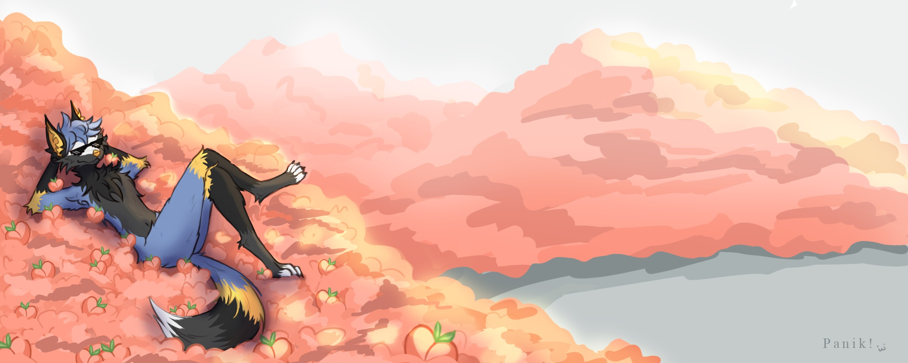
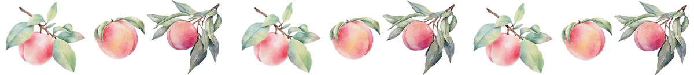

# Woki / Воки
> *А чё писать то, лол*

---

## [Обо мне]

+ 20 лет
+ Стараюсь программировать разное (но лень)
+ Использую ИИ
+ Фуррэ кстати

## [Проекты]

### CaveDreamsMod
> *Попытка сделать мод*

Мод для Minecraft (Fabric 1.20.1) - Тестовый мод для понимания как они вообще создаются. Добавляет 2 предмета и одного моба с уникальными механиками.

---

#### [MultiplayerUltimateSnakeAttack]
> *Соавторство компьютерных червей*

Многопользовательская змейка с боссами, бонусами, магазином скинов и таблицей рекордов.

---

### [Контакты]

